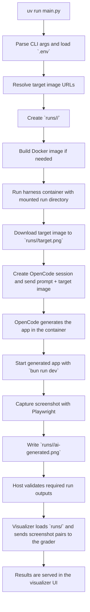

# UI Replication Benchmark

This repository generates UI replication runs with an OpenCode-powered Docker harness, stores the resulting screenshots in `runs/`, and visualizes the outputs with an LLM-based grader.

## How It Works

The main entrypoint is:

```bash
uv run main.py
```

At a high level, the pipeline looks like this:



### Step-by-step

1. `main.py` loads `.env`, parses CLI flags, and resolves the target image list.
2. Every run gets its own `runs/<run-id>/` directory on the host.
3. `main.py` starts a Docker container and mounts that run directory into the container as the output location.
4. Inside the container, the OpenCode harness downloads the reference image as `target.png`, creates an OpenCode session, submits the prompt plus the reference image, and waits for generation to finish.
5. After code generation completes, the harness starts the generated app with `bun run dev`.
6. Playwright captures the generated UI and saves it as `ai-generated.png`.
7. Control returns to `main.py`, which verifies that both required images exist.
8. If scoring is enabled, the visualizer reads `runs/`, pairs each `target.png` with its `ai-generated.png`, and asks the grader to score the similarity.
9. The visualizer serves static frontend files from `visualize/frontend`, run images from `/runs/...`, and scored JSON results from `/api/results`.

### Key outputs

- `runs/<run-id>/target.png`
- `runs/<run-id>/ai-generated.png`

## Setup

### Prerequisites

- Python 3.12+
- [`uv`](https://docs.astral.sh/uv/)
- Docker
- An `.env` file for any API credentials your run needs

At minimum, scoring requires:

```bash
OPENROUTER_API_KEY=...
```

Depending on your OpenCode deployment, you may also need:

```bash
OPENCODE_SERVER_URL=...
OPENCODE_SERVER_USERNAME=...
OPENCODE_SERVER_PASSWORD=...
OPENCODE_TIMEOUT_SECONDS=...
```

`main.py` automatically loads `.env` from the repo root if it exists.

### Install dependencies

From the repository root:

```bash
uv sync
```

If you want the local screenshot tooling available outside Docker as well:

```bash
uv sync --extra harness
uv run playwright install chromium
```

### Generate runs

Use the default target set:

```bash
uv run main.py
```

By default, the benchmark uses the Hugging Face dataset at [Akshath-Nag/UIReplicationBenchMark](https://huggingface.co/datasets/Akshath-Nag/UIReplicationBenchMark). You can also pass your own image URL or a Hugging Face dataset or subfolder URL:

```bash
uv run main.py --target-image-url https://huggingface.co/datasets/Akshath-Nag/UIReplicationBenchMark
```

You can also point directly at a single reference image:

```bash
uv run main.py --target-image-url https://example.com/reference.png
```

Useful flags:

- `--prompt "..."` to override the default OpenCode prompt
- `--no-score` to skip score/report generation
- `--score false` as another way to disable scoring

Successful runs populate `runs/<run-id>/target.png` and `runs/<run-id>/ai-generated.png`.

## Visualizing Results

Launch the visualizer:

```bash
uv run visualize
```

By default it serves the app at:

```text
http://127.0.0.1:8000/
```

Useful visualizer flags:

- `--runs-dir <path>` to visualize a different runs directory
- `--port <port>` to change the local port
- `--no-serve` to precompute results without starting the server

The visualization backend lives in [`visualize`](/Users/aknag/Desktop/UIReplicationBenchMark/visualize), and the frontend lives in [`visualize/frontend`](/Users/aknag/Desktop/UIReplicationBenchMark/visualize/frontend).

The visualizer also exposes a JSON payload at:

```text
http://127.0.0.1:8000/api/results
```

### Sample visualizer screenshot


The visualizer reads each run directory, compares the saved screenshot pair, and displays the resulting scores alongside the target and generated images.
